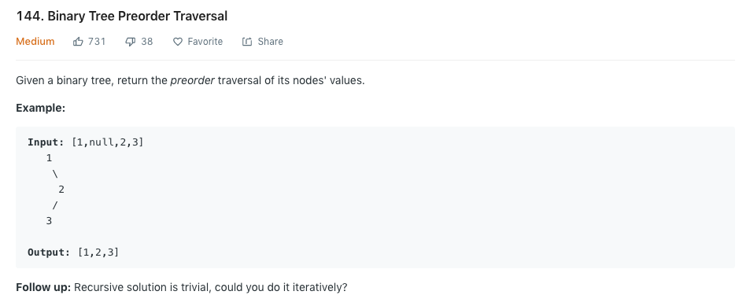

## 144. Binary Tree Preorder Traversal

### 题目分析
给定一个二叉树，返回其前序遍历的顺序值，如果没有返回null

****
### :pencil2:题目实例

<a href="https://github.com/kobe148/go-hack">
   
</a> 

****
### :pencil2:题目分析
前序遍历不用我介绍了吧，简单的说顺序就是根节点->左节点->右节点。因为这里是递归专区，因此只会用递归解题，递归最重要的两步
* 递归终止条件
* 递推公式

那么在这一道题中，终止条件即:<font color="#FF0000">根节点为null</font>，剩下的就是找递推公式。

### :pencil2:最终实现代码
```go
/**
 * Definition for a binary tree node.
 * type TreeNode struct {
 *     Val int
 *     Left *TreeNode
 *     Right *TreeNode
 * }
 */
func preorderTraversal(root *TreeNode) []int {
    var res[]int
    handle(root,&res)
    return res;
}

func handle (root *TreeNode,res *[]int)interface{}{
    if root == nil{
        return nil
    }
    *res=append(*res,root.Val)
    handle(root.Left,res)
    handle(root.Right,res)
    return nil
}
```
 