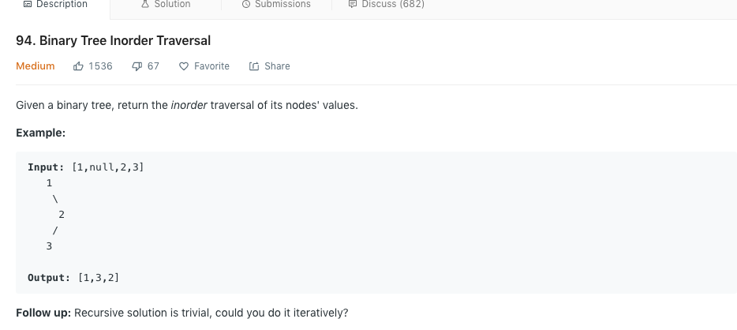

## 94. Binary Tree Inorder Traversal

### 题目分析
给定一个二叉树，返回中序遍历的顺序值，如果没有返回null

****
### :pencil2:题目实例

<a href="https://github.com/kobe148/go-hack">
   
</a> 

****
### :pencil2:题目分析
中序遍历不用我介绍了吧，简单的说顺序就是左节点->根节点->右节点。因为这里是递归专区，因此只会用递归解题，递归最重要的两步

### :pencil2:最终实现代码
```go
/**
 * Definition for a binary tree node.
 * type TreeNode struct {
 *     Val int
 *     Left *TreeNode
 *     Right *TreeNode
 * }
 */
func inorderTraversal(root *TreeNode) []int {
    var res[]int
    countTree(root,&res)
    return res
}

func countTree(root *TreeNode,res *[]int){
    if root ==nil{
        return 
    }
    
    countTree(root.Left,res)
    *res=append(*res,root.Val)
        countTree(root.Right,res)
}
```
 